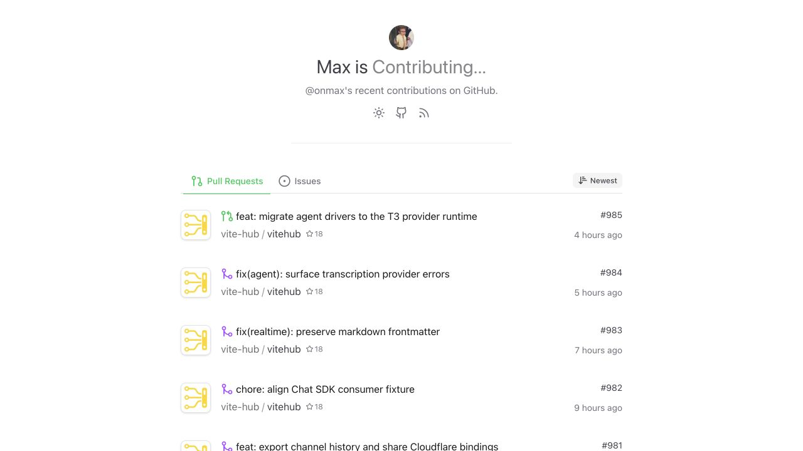
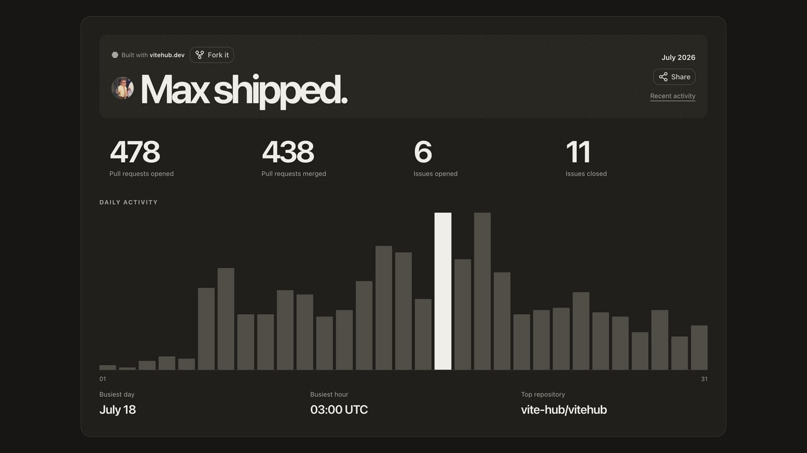

# My Pull Requests

Showcase your recent open source contributions and publish a shareable GitHub recap every month. See it live at [prs.onmax.me](https://prs.onmax.me).

This is a [ViteHub](https://vitehub.dev) project. ViteHub Schedule, Workflow, KV, Email, and Markdown Template primitives produce and deliver the monthly recap.

## Recent contributions

[](https://prs.onmax.me)

## Monthly recap

[](https://prs.onmax.me/recap/2026-07)

## Features

- Lists your 50 most recent pull requests and issues, with sorting by date or repository stars.
- Publishes an RSS feed at `/feed.xml`.
- Collects the previous month's GitHub activity on the first day of each month.
- Stores, emails, and publishes a visual recap with contribution totals, busiest periods, top repository, and daily activity.

## Setup

Use Node.js 24.15 or newer and [pnpm](https://pnpm.io/installation#using-corepack), then install the dependencies:

```bash
corepack enable
pnpm install
```

Copy the environment template:

```bash
cp .env.example .env
```

Create a [fine-grained GitHub token](https://github.com/settings/personal-access-tokens/new) with no additional permissions and add it to `.env`:

```bash
NUXT_GITHUB_TOKEN=your-github-token
```

The contribution page and RSS feed only need the GitHub token. To run the monthly recap, also configure its sender, recipient, and public URL:

```bash
RECAP_FROM=recap@example.com
RECAP_SITE_URL=http://localhost:3000
RECAP_TO=you@example.com
```

Email delivery and KV storage depend on the deployment target, as described below.

## Development

Start the development server on `http://localhost:3000`:

```bash
pnpm dev
```

## Production

Build the application for production:

```bash
pnpm build
```

## Deploy anywhere

ViteHub keeps the application code portable across hosts. The repository defaults to Cloudflare; another host needs a different `vitehub.preset` and, when the host has no native email binding, an explicit email driver.

| Host | KV | Email |
| --- | --- | --- |
| Cloudflare Workers | A `KV` namespace binding; no runtime API key | An `EMAIL` send binding; no API key |
| Vercel | Upstash through `KV_REST_API_URL` and `KV_REST_API_TOKEN` | Resend through `RESEND_API_KEY` |
| Your own VPS | Persistent local storage on one server, or an external KV service for multiple replicas | Resend through `RESEND_API_KEY` |

### Cloudflare Workers

Cloudflare is the default target. Create a KV namespace, enable Email Service for your sending domain, and enable Browser Run. Bind them as `KV`, `EMAIL`, and `BROWSER`. `email: true` selects Cloudflare Email automatically, and `/api/recaps/:month/screenshot.png` uses Browser Run Quick Actions to capture the visual recap as a PNG.

Set `NUXT_GITHUB_TOKEN`, `RECAP_FROM`, `RECAP_SITE_URL`, and `RECAP_TO` in the Worker environment, then deploy the generated Worker:

```bash
pnpm build
pnpm exec nitro deploy --prebuilt
```

See [ViteHub on Cloudflare](https://vitehub.dev/docs/frameworks-hosts/cloudflare).

### Vercel

The configuration selects Vercel and Resend automatically when Vercel sets `VERCEL`. Connect an Upstash Redis integration so Vercel injects `KV_REST_API_URL` and `KV_REST_API_TOKEN`, then add `RESEND_API_KEY` and the common recap variables before deploying through Git or the Vercel CLI.

See [ViteHub on Vercel](https://vitehub.dev/docs/frameworks-hosts/vercel).

### Your own VPS

A VPS is the larger operational path because you own the long-running Node process, persistent volume, TLS, backups, and restarts. Self-hosting requires selecting ViteHub's `node` preset, using the Schedule process runtime, configuring OpenWorkflow with SQLite or Postgres, and choosing an email driver such as Resend with its API key.

One VPS can keep KV and Workflow state on a mounted persistent volume without a KV API key. Use an external durable store when the filesystem is ephemeral or the app runs on multiple replicas.

After configuring the Node providers, build and run the server:

```bash
pnpm build
node .output/server/index.mjs
```

See [ViteHub on Node and self-hosted servers](https://vitehub.dev/docs/frameworks-hosts/node-self-hosted).

## Credits

The original idea and project are by [Sébastien Chopin](https://github.com/atinux): [atinux/my-pull-requests](https://github.com/atinux/my-pull-requests), live at [prs.atinux.com](https://prs.atinux.com). His project was inspired by [Anthony Fu](https://github.com/antfu)'s [releases.antfu.me](https://github.com/antfu/releases.antfu.me).

## License

[MIT](./LICENSE)
